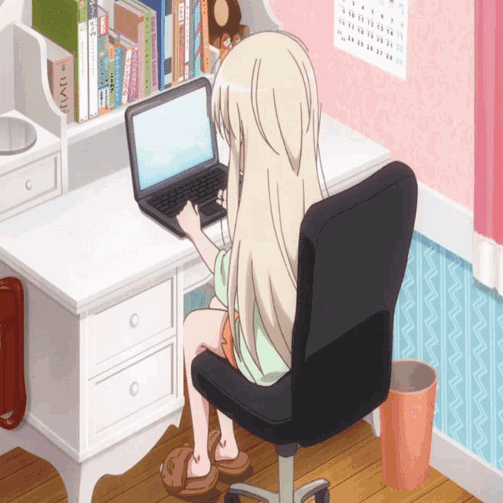

 

 **AI Engineering student** · 5th semester  
🔍 Curious by nature, resilient by choice  
💡 Passionate about learning, clean code & cozy aesthetics ✨  
🌸 Building projects one commit at a time  

 

 

---

> *"Fall seven times, stand up eight."* 🌱

---

##  **Skills**

### ₊˚ʚ 🌱 Technologies and tools ₊˚✧ﾟ.

🖥️ Programming Languages
  

💾 Databases
  

⚙️ Tools & Applications
  

---

### 𓍢ִ໋ ☕️ GitHub Stats ✧˚ ༘ ⋆

 

 

  

---

### ˖ Contact me 🎐

  
  
  

